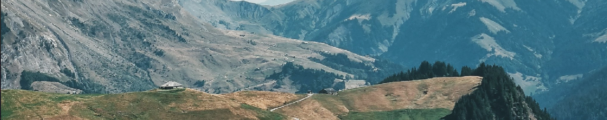

# Roadbook



<p align="center">
  •
  <a href="https://roadbook.fly.dev/"><b>Beta website</b></a> •
  <a href="https://github.com/users/mjanv/projects/3"><b>Roadmap</b></a> •
  <a href="https://www.figma.com/file/ZxA1656udohBlMsEj8ofSK/Roadbook-Domain-Map?type=whiteboard&t=Y0rFnZdNsAspzvCe-1"><b>Domain Mapping</b></a> •
  <a href="https://www.figma.com/file/HVuZImZqz042oSA522f2uh/Roadbook?type=design&node-id=0%3A1&mode=design&t=Y0rFnZdNsAspzvCe-1"><b>Website design</b></a> •
  <a href="https://github.com/mjanv"><b>Github</b></a>
  •
</p>

---

*Roadbook* is a website connecting features between your favorite route planner and climb finder websites.

- On climb finders such as [climbfinder.com](https://climbfinder.com/en) or [cols-cyclisme.com](https://www.cols-cyclisme.com/), a cyclist can see climb profiles ([Alpe d'Huez](https://climbfinder.com/en/climbs/alpe-d-huez), [Col de la Loze](https://www.cols-cyclisme.com/vanoise/france/col-de-la-loze-depuis-brides-les-bains-c3612.htm),...) that breakdowns climb average slope kilometer per kilometer.
- On route planners such as [Komoot](https://www.komoot.com) or [Strava](https://www.strava.com), a cyclist can creates a route where he can see a map display with the full elevation profile, but with no climbs breakdown.
- On professionnal cycling events, all riders have access to a printed detailled roadbook ([Tour de France 1957-1962-1969 roadbooks](https://procyclingmaps.com/tourdefrance/), [L'étape du tour roadbook](https://www.letapedutourdefrance.com/en/extra-services/road-book), [Giro d'Italia roadbook](https://www.giroditalia.it/en/roadbook/), [Vuelta roadbook](https://www.lavuelta.es/en/interactive-roadbook),...).

*Roadbook* helps you **draw and print a full roadbook from a collection of stages of favorite route planner**.

## Roadmap

- A [roadmap](https://github.com/users/mjanv/projects/3) of next developments is available on Github.
- The current [beta version](https://roadbook.fly.dev/) of the website is available, with no guarantee of data retention.
- Current [domain mapping](https://www.figma.com/file/ZxA1656udohBlMsEj8ofSK/Roadbook-Domain-Map?type=whiteboard&t=Y0rFnZdNsAspzvCe-1) is available on Figma.
- Current [website design](https://www.figma.com/file/HVuZImZqz042oSA522f2uh/Roadbook?type=design&node-id=0%3A1&mode=design&t=Y0rFnZdNsAspzvCe-1) is available on Figma.

## Development

To develop, you need to have [just](https://github.com/casey/just), [docker](https://www.docker.com/) and [docker-compose](https://docs.docker.com/compose/) installed. Differents stacks can be started to help you through development.

### Local development

To run the [web application](http://localhost:4001) for local development,

```bash
just server
```

### Notebooks

To help develop the application, you can use the notebooks accessible in the `notebooks/` folder. Any notebook can be displayed using the [local livebook](http://localhost:8080/open/file),

```bash
just notebooks
```

### Tests

To ensure that code quality and unit tests requirements are met,

```bash
just tests
```

### Local demonstration

To run the full application stack ([Application](http://localhost:4001), [Livebook](http://localhost:8080/open/file), [Grafana](http://localhost:3000)) for demonstration purposes,

```bash
just app
```

### Stop the stack

All stacks (local development, notebooks, tests, local demonstration) can be stopped using,

```bash
just stop
```

## Ressources

### Geodata

- [Playing with GPX tracks in Elixir and PostGIS](https://caspg.com/blog/playing-with-gpx-tracks-in-elixir-and-postgis)
- [How to draw routes on a Maplibre GL (Mapbox GL) map](https://www.geoapify.com/tutorial/draw-route-on-the-maplibre-mapbox-map)

### Front-end

- [Create a to-do list app with Phoenix, React, and TypeScript](https://blog.logrocket.com/to-do-list-phoenix-react-typescript/)
- [Modern Webapps with React, Phoenix, Elixir and TypeScript](https://bpaulino.com/entries/modern-webapps-with-elixir-phoenix-typescript-react)

### Search

- [The Complete Guide to Full-text Search with Postgres and Ecto](https://www.peterullrich.com/complete-guide-to-full-text-search-with-postgres-and-ecto)
